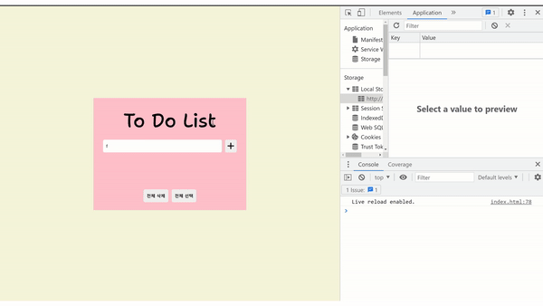

# To Do List

## [링크](https://strong-hamster-fadef1.netlify.app)

## 소개



웹 개발자라면 많이들 해보는 투두 리스트를 만들어 봤다.
아마 프론트엔드 개발자라면 초반단계에 이걸 하는데 좀 늦게 하게 되었다.

추가 / 삭제까지 구현하고 보니까 js에서 css를 건드리게 되는 비효율적 코드를 짜게 돼서 구글링을 통해 여러 사람들꺼 중 가장 좋아보이고 유기적으로 연결되어있는 코드를 참고하였다.

특히 최대한 저번에 공부한 문벅스 예제와 동일한 로직을 구현하려고 하였다.

즉, 옵저버 패턴식으로 상태가 변경되면 화면에 계속 렌더링을 하는 방식을 채택하였다.

이후에 로컬스토리지와 연결된 코드로 수정하였다.

### 사용한 기술 스택

  

<br>
<br>

## html

```html
<body>
  <div class="wrapper">
    <h1 class="title">To Do List</h1>

    <section class="write__box">
      <input type="text" class="todo__input" placeholder="할 일 추가하기" />
      <button class="btn__add">
        <i class="fa-solid fa-plus icon__add"></i>
      </button>
    </section>

    <ul class="todolist"></ul>

    <section class="all">
      <button class="btn__all btn__all__delete">전체 삭제</button>
      <button class="btn__all btn__all__select">전체 선택</button>
    </section>
  </div>
</body>
```

## 기능

- ### 추가

  - 할 일을 버튼을 누르거나 엔터를 눌러서 추가

- ### 선택

  - list 왼쪽에 동그란 영역을 선택(check 표시, 취소선)
  - 전체선택 버튼을 눌러 전체선택

- ### 삭제

  - X 버튼을 눌러 삭제
  - 전체삭제 버튼을 눌러 전체삭제

- ### 수정

  - Edit 버튼을 눌러 수정
  - 수정 시에 다른 영역을 클릭하면 원래대로 돌아감

- ### 새로고침시에도 유지

## 오류해결

### 1. key value 한 쌍에 정보를 저장하자.

기존에는 `key`값을 id로하고, `value`값을 객체로 하는 배열을 로컬스토리지에 계속해서 저장하고 받아왔는데 이런 식으로 하면 추가 / 삭제 / 수정이 모두 복잡해지므로 `key`값은 그냥 String값으로 두고, `value` 값에 각각의 투두리스트가 배열의 원소가 되어서 배열로 저장하는 것이 바람직한 방법이다.

### 2. 객체 / 배열을 로컬로 넘기거나 받을 때 문제

```js
const setTodos = (newTodos) => {
  // 로컬 업데이트
  localStorage.setItem("todolist", JSON.stringify(newTodos));
};

// 로컬로 부터 받아오기
const getAllTodos = () => {
  return localStorage.getItem("todolist")
    ? JSON.parse(localStorage.getItem("todolist"))
    : [];
};
```

==> 로컬 : `JSON.stringify(object)` : 로컬로 넘길때는 자바스크립트 형식에서 json 문자열 형식으로 바꿔야 한다.

<== 로컬 : `JSON.parse()` : 로컬에서 받아올 때는 json 형식을 자바스크립트가 이해할 수 있는 형식으로 바꿔야 한다.

### 3. 새로고침 시 id가 초기화되는 문제


```js
const appendTodos = (text) => {
  const currenttodos = getAllTodos();
  const newId = id++;
  const newTodos = { id: newId, isSelected: false, content: text };
  currenttodos.push(newTodos);
  setTodos(currenttodos); // todo 업데이트
  paintTodos();
};
```

업로드하고 마지막에 오류를 발견하였다.
새로고침 후 기존에 저장되어있던 리스트에 할 일을 추가하면 `id`값이 0부터 다시 초기화되서 추가가 되는 문제가 발생한다.
id 값은 로컬에서 받아오는 값이 아니라 새로고침 시 전역변수로써 0으로 초기화 되므로 문제가 발생한다.

```js
const appendTodos = (text) => {
  const currenttodos = getAllTodos();
  let id = currenttodos.length;
  const newTodos = { id: id, isSelected: false, content: text };
  currenttodos.push(newTodos);
  setTodos(currenttodos); // todo 업데이트
  paintTodos();
};
```

전역에 있는 `id`변수를 우선 제거하고, 할일을 추가할때마다 id 값을 로컬스토리지의 객체의 개수를 받아와 문제를 해결 하였다.


## 느낀점

### 1. 오류를 기록하자.

그때그때 오류를 캡처해서 문서에 남겨서 다시 상기할 수 있도록 하자!

다음번에 똑같은 실수를 줄일 수 있을 것이다.

### 2. 데드라인을 정해놓고 하자.

한번 흐름을 타면 집중을 해서 많은 양의 일을 해결할 수 있는데 그렇지 못하면 호흡이 길어진다.

따라서 데드라인을 정해서 집중도를 높여보자.

### 3. Netlify가 아닌 Github 배포를 이용해보자.

배포해놓고 수정할 일이 생기면 Netlify에 일일이 접근해서 수정을 해야하는데 번거로우니 Github 배포를 적극 사용해보자.
